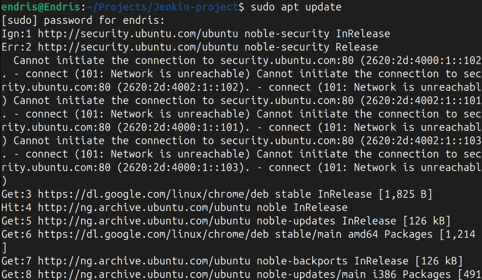
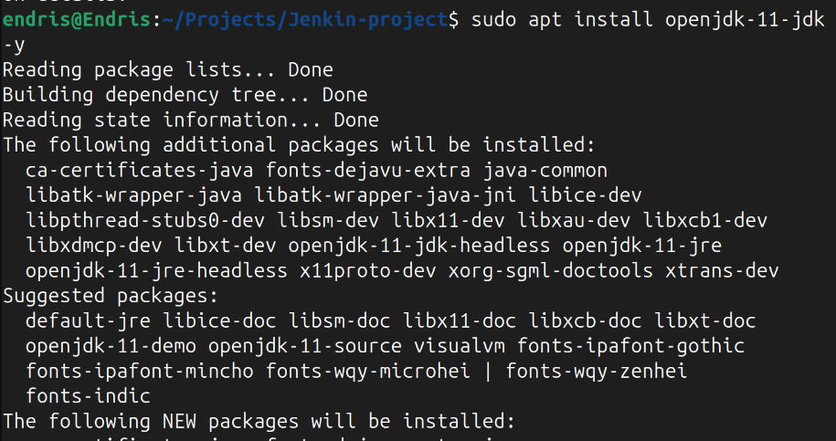
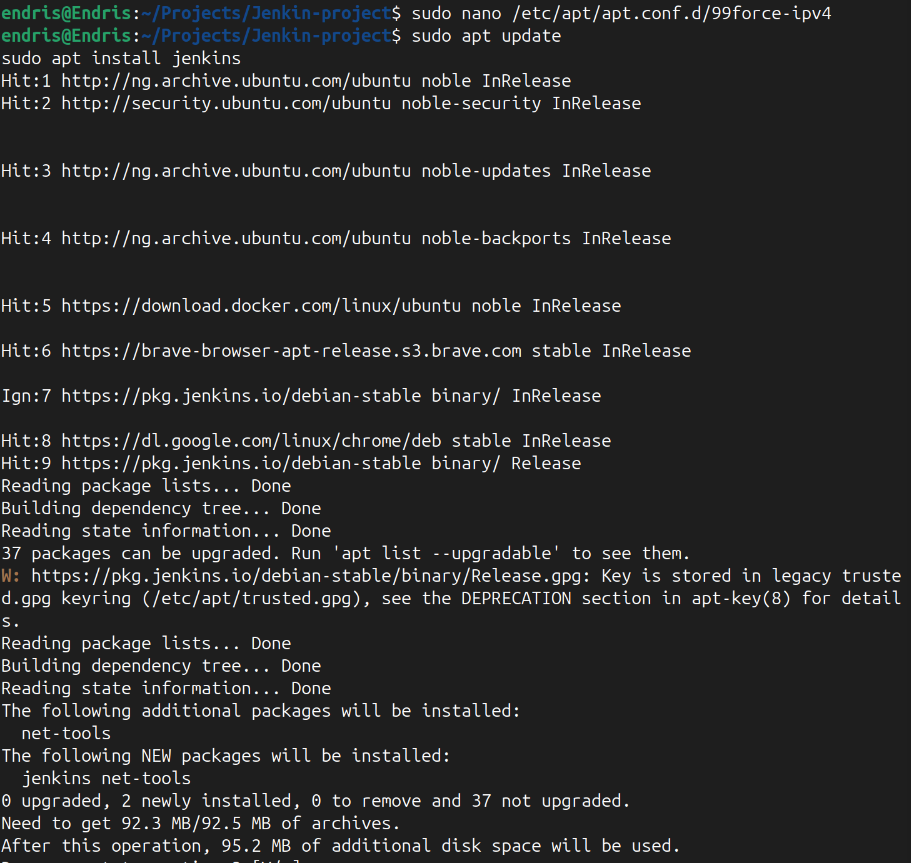
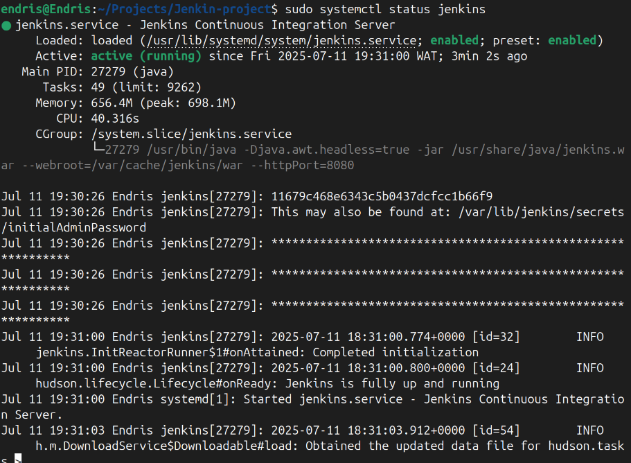
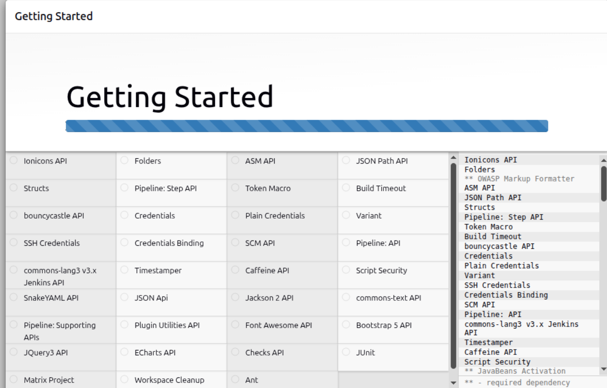
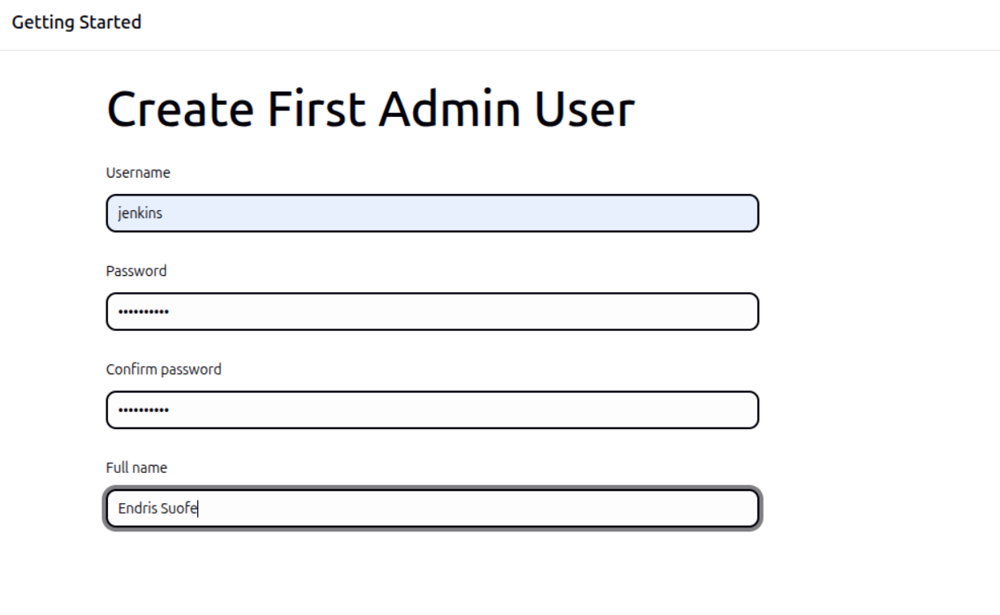
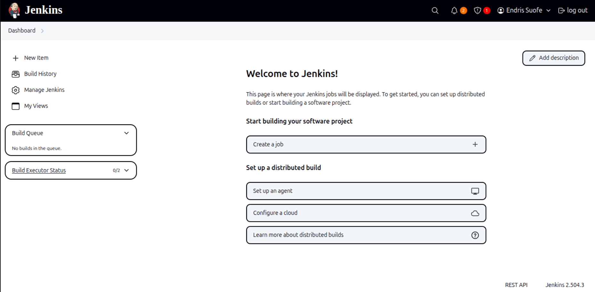

# 🧩 Jenkins Project – Introduction to CI/CD

In this mini project, I set up **Jenkins** on a Linux machine (with an option for AWS EC2) and explored the basics of **CI/CD** (Continuous Integration and Continuous Delivery). This README documents my journey, the steps I took, and what I learned along the way.

---

## 🚀 What I Learned About CI/CD

CI/CD is a modern software development approach that helps teams ship code faster and with fewer errors. Here's how I understand it:

* **Continuous Integration (CI):** Developers push code changes regularly. Jenkins automatically builds and tests the code to catch errors early.
* **Continuous Delivery/Deployment (CD):** Jenkins ensures code is always in a deployable state, and can even automate deployment.

CI/CD reduces manual work, encourages frequent releases, and builds confidence in the codebase.

---

## 🔧 What Jenkins Is and Why It Matters

Jenkins is an open-source automation server that is used to automate builds, tests, and deployments. It supports version control (like Git) and allows users to define pipelines as code. Jenkins helps build consistent, repeatable workflows.

---

## 📝 Prerequisites

Before starting, I had already completed:

* Foundation Core Programs 1 – 3
* Basic Linux operations
* Hands-on with EC2 and package management

---

## 🎯 What I Set Out to Do

By the end of this project, I wanted to:

* Understand Jenkins and how it fits into CI/CD
* Install and run Jenkins on a Linux machine (or EC2 instance)
* Access Jenkins from the browser and complete the initial setup
* Land on the Jenkins dashboard successfully

---

## 🛠️ Installing Jenkins

You can install Jenkins on **any Linux machine** (including your local machine or a cloud VM like AWS EC2). The steps are almost identical, but if you use EC2, make sure to configure your security group as described below.

### ✅ Step 1: Update Repositories

```bash
sudo apt update
```

> 

---

### ✅ Step 2: Install Java JDK

Jenkins requires Java to run. Install OpenJDK 11:

```bash
sudo apt install openjdk-17-jdk -y
```

> 

---

### ✅ Step 3: Install Jenkins

Add Jenkins’ GPG key and repository, then install Jenkins:

```bash
wget -q -O - https://pkg.jenkins.io/debian-stable/jenkins.io.key | sudo apt-key add -
sudo sh -c 'echo deb https://pkg.jenkins.io/debian-stable binary/ > /etc/apt/sources.list.d/jenkins.list'
sudo apt update
sudo apt-get install jenkins -y
```

> 

---

### ✅ Step 4: Start and Check Jenkins Service

Start Jenkins and confirm it’s running:

```bash
sudo systemctl start jenkins
sudo systemctl status jenkins
```

> 

---

## 🌐 Accessing Jenkins from Your Browser

### 🔓 Step 5: Open Port 8080 (For EC2 Users)

If you installed Jenkins on an **AWS EC2 instance**, you must open port 8080 in your EC2 security group:

* Type: Custom TCP
* Port: 8080
* Source: Anywhere (0.0.0.0/0) or restrict as needed

If you installed Jenkins on your **local machine**, ensure your firewall allows connections to port 8080 if you want to access Jenkins from another device.

---

### 🔑 Step 6: Unlock Jenkins

To access the dashboard, open your browser and visit:

```
http://<server-ip>:8080
```

- For EC2: use your instance’s public IP.
- For local: use `localhost` or your machine’s IP.

Retrieve the admin password:

```bash
sudo cat /var/lib/jenkins/secrets/initialAdminPassword
```

---

### 📦 Step 7: Install Suggested Plugins

Choose the "Install Suggested Plugins" option when prompted.

> 

---

### 👤 Step 8: Create Admin User

Create your Jenkins admin account with a username and password of your choice.

> 

---

### ✅ Step 9: Jenkins Dashboard

Once setup is complete, you’ll land on the Jenkins dashboard, confirming a successful installation.

> 

---

## 📝 Summary

In this project, I:

* Learned how CI/CD enables fast, automated, and reliable software delivery
* Installed Jenkins on a Linux machine (with EC2 as an option)
* Opened the necessary port and completed the browser setup
* Successfully accessed the Jenkins dashboard

All terminal output screenshots are saved in the `img` folder as evidence of each step in my learning.

---

## 💡 Notes

- For more details, see the [official Jenkins documentation](https://www.jenkins.io/doc/book/installing/).
- If using a cloud VM other than EC2, adjust firewall/security group settings as needed to allow access to port 8080.
